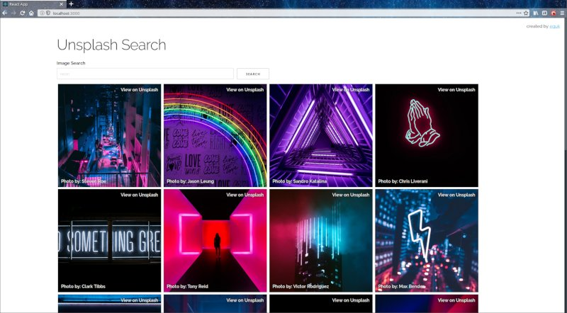

# unsplash-react
:camera: unsplash search using react.js

- [x] Stateful Components
- [x] Loading Feedback
- [x] Async API Requests
- [x] API Key Seperated Using `.env`
- [x] Conditional Rendering
- [x] Virtual DOM

requirements: [unsplash developer api key](https://unsplash.com/developers)

add unsplash developer key to `.env` file in base of project

    REACT_APP_API_CLIENTID="insert-api-key-here"

## unsplash references

- https://unsplash.com/documentation
- https://unsplash.com/api-terms

## screenshot

### notes

> Unsplash API Terms (Attribution)
>
> Each time you or your Developer App displays a Photo, your Developer App must attribute Unsplash, the Unsplash photographer, and contain a link back to the photographer’s Unsplash profile.